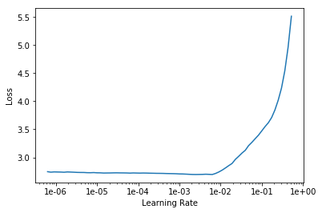
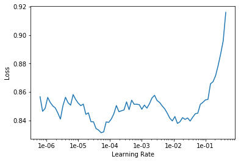

# journal.ai


```python
%reload_ext autoreload
%autoreload 2
%matplotlib inline
```


```python
from fastai.text import *
```


```python
path = Path('.')
```


```python
df = pd.read_csv('data-split.csv', error_bad_lines=False)
df.drop(axis = 1, inplace = True, columns = 'Unnamed: 0' )
df.head()
```


<div>
<table border="1" class="dataframe">
  <thead>
    <tr style="text-align: right;">
      <th></th>
      <th>Label</th>
      <th>Text</th>
      <th>is_valid</th>
    </tr>
  </thead>
  <tbody>
    <tr>
      <th>0</th>
      <td>negative</td>
      <td>That’s the last thing I want to be seen as.</td>
      <td>True</td>
    </tr>
    <tr>
      <th>1</th>
      <td>positive</td>
      <td>But today, I learned that not everyone just wa...</td>
      <td>True</td>
    </tr>
    <tr>
      <th>2</th>
      <td>neutral</td>
      <td>Now, the hole’s that much smaller.</td>
      <td>True</td>
    </tr>
    <tr>
      <th>3</th>
      <td>positive</td>
      <td>I’ve had a couple shots with friends in differ...</td>
      <td>True</td>
    </tr>
    <tr>
      <th>4</th>
      <td>neutral</td>
      <td>He was grateful for his wife's submission and ...</td>
      <td>True</td>
    </tr>
  </tbody>
</table>
</div>


## Training Language Model

I trained a language model based on the wikitext-103 dataset for transfer learning


```python
data_lm = (TextList.from_df(df, path, 1)
           #We may have other temp folders that contain text files so we only keep what's in train and test
            .split_by_rand_pct(0.1)
           #split by random percent
            .label_for_lm()           
           #We want to do a language model so we label accordingly
            .databunch(bs=64))
data_lm.show_batch()
```


<table border="1" class="dataframe">
  <thead>
    <tr style="text-align: right;">
      <th>idx</th>
      <th>text</th>
    </tr>
  </thead>
  <tbody>
    <tr>
      <td>0</td>
      <td>' xxunk and xxunk of heart . xxbos xxmaj somehow , someone else in my life always xxunk up having the same problems i do . xxbos i 'm so very happy to say the xxmaj ghost has officially stopped xxunk me . xxbos xxmaj it ’s all xxup so fucking hard . xxbos i sit alone in my room watching tv and drinking myself to death . xxbos xxmaj</td>
    </tr>
    <tr>
      <td>1</td>
      <td>xxbos xxmaj it was interesting though . xxbos xxmaj turns out i xxunk pass it every day on the way to school or church . xxbos ​ \n  xxmaj as much as i 'd like to start with xxunk xxunk and start xxunk " xxunk " i figure the xxunk of this take is more xxunk to the left hand not knowing what the right hand is up to</td>
    </tr>
    <tr>
      <td>2</td>
      <td>sister in law is against . xxbos xxmaj sometimes it ’s not about him . xxbos i said i was sorry a bunch more and xxunk up . xxbos xxmaj our next date was after work one night . xxbos xxmaj but he ’s gon na know tomorrow because i ’m 100 % putting something on my close friends story . xxbos xxmaj today , i learned that it ’s</td>
    </tr>
    <tr>
      <td>3</td>
      <td>" xxbos all the coworkers was xxunk me up to drink like crazy . xxbos xxmaj but that was my worst break down since before winter break . xxbos xxmaj and that would be xxunk . xxbos xxmaj then it just keeps getting worse . xxbos i do n’t believe the world should get to know me . xxbos xxmaj probably my self xxunk demon talking to me again .</td>
    </tr>
    <tr>
      <td>4</td>
      <td>way he was the only problem i had . xxbos xxmaj alright , that 's all for now . xxbos xxmaj my life is a xxunk car xxunk and i 'm not at the hospital yet . xxbos i ’d love to be xxunk , but i just do n’t want to be in charge . xxbos i talked to my parents with love and xxunk and a lot to</td>
    </tr>
  </tbody>
</table>


```python
learn = language_model_learner(data_lm, AWD_LSTM, drop_mult=0.3)
```

## Learning Rate Plot
The block of code below was run after each round of training of the language model so I could adjust learning rate accordingly


```python
learn.lr_find()
learn.recorder.plot()
```


    LR Finder is complete, type {learner_name}.recorder.plot() to see the graph.





## Actual training of language model starts here


```python
learn.fit_one_cycle(5, 1e-2, moms=(0.8,0.7))
```


<table border="1" class="dataframe">
  <thead>
    <tr style="text-align: left;">
      <th>epoch</th>
      <th>train_loss</th>
      <th>valid_loss</th>
      <th>accuracy</th>
      <th>time</th>
    </tr>
  </thead>
  <tbody>
    <tr>
      <td>0</td>
      <td>5.421369</td>
      <td>4.725654</td>
      <td>0.179018</td>
      <td>00:03</td>
    </tr>
    <tr>
      <td>1</td>
      <td>4.781559</td>
      <td>3.761340</td>
      <td>0.236049</td>
      <td>00:03</td>
    </tr>
    <tr>
      <td>2</td>
      <td>4.288232</td>
      <td>3.436159</td>
      <td>0.296429</td>
      <td>00:03</td>
    </tr>
    <tr>
      <td>3</td>
      <td>3.959905</td>
      <td>3.370436</td>
      <td>0.312054</td>
      <td>00:03</td>
    </tr>
    <tr>
      <td>4</td>
      <td>3.740791</td>
      <td>3.357476</td>
      <td>0.318080</td>
      <td>00:03</td>
    </tr>
  </tbody>
</table>


```python
learn.save('fit_head')
```


```python
learn.load('fit_head')
```

```python
learn.unfreeze()
```


```python
learn.fit_one_cycle(3, 1e-3, moms=(0.8,0.7))
```


<table border="1" class="dataframe">
  <thead>
    <tr style="text-align: left;">
      <th>epoch</th>
      <th>train_loss</th>
      <th>valid_loss</th>
      <th>accuracy</th>
      <th>time</th>
    </tr>
  </thead>
  <tbody>
    <tr>
      <td>0</td>
      <td>3.171326</td>
      <td>3.265398</td>
      <td>0.323996</td>
      <td>00:05</td>
    </tr>
    <tr>
      <td>1</td>
      <td>3.049433</td>
      <td>3.255127</td>
      <td>0.323772</td>
      <td>00:05</td>
    </tr>
    <tr>
      <td>2</td>
      <td>2.933176</td>
      <td>3.284370</td>
      <td>0.323326</td>
      <td>00:05</td>
    </tr>
  </tbody>
</table>


```python
learn.save('fine_tuned')
```


```python
learn.load('fine_tuned')
```


```python
learn.save_encoder('fine_tuned_enc')
```

# Classifier
Now that I have a good language model as a base, I can train the classifier


```python
data_clas = (TextList.from_df(df, path,1, vocab=data_lm.vocab)
             #grab dataframe
             .split_from_df()
             #split into valid and train based on column is_valid
             .label_from_df(0)
             #label them all with their folders
             .databunch(bs=64))
```


```python
data_clas.show_batch(20)
```


<table border="1" class="dataframe">
  <thead>
    <tr style="text-align: right;">
      <th>text</th>
      <th>target</th>
    </tr>
  </thead>
  <tbody>
    <tr>
      <td>xxbos xxmaj honestly , i 'm xxunk to post here because i went through my xxunk trying to figure out which one would be best for what i have to way , and it was either this one or r / xxunk , and the thought of xxunk there just gave me anxiety because i worried that maybe 50 xxunk people would xxunk and i think i 'd feel xxunk</td>
      <td>neutral</td>
    </tr>
    <tr>
      <td>xxbos xxmaj work was good , and my day went well , but i did n't have a chance to talk to my xxmaj xxunk as much over the last few days , and then when we did talk i feel like we 've been a bit xxunk at times and whenever that happens i become xxunk and a bit xxunk with xxunk that i 've done something wrong and</td>
      <td>positive</td>
    </tr>
    <tr>
      <td>xxbos ​ \n  xxmaj just ... get off at that xxunk and never have to deal with a life of xxunk to the teachers xxunk to xxunk up a frozen xxunk ( that you 'll have to xxunk down while it 's still half frozen ) , xxunk xxunk depends because you literally only have a four minute restroom break ( and you 're xxunk to share a restroom</td>
      <td>negative</td>
    </tr>
    <tr>
      <td>xxbos i also need to xxunk for xxup xxunk xxunk but keep putting it off and i just spent the evening looking at pay scale stuff in my xxunk and trying to xxunk how much xxunk i will need to take on and it 's all very xxunk xxunk i am having my xxunk and i just started .</td>
      <td>negative</td>
    </tr>
    <tr>
      <td>xxbos xxmaj my plan for this morning is xxup for xxup xxunk . b xxup to xxup show xxup up , xxunk me some xxunk xxunk xxunk , go get a pass from xxmaj fink , take that math test , and coat a screen with the xxunk and leave it to dry in seminar .</td>
      <td>negative</td>
    </tr>
    <tr>
      <td>xxbos xxmaj without xxunk weed and xxunk xxunk mental xxunk idk what i ’m doing i can feel myself getting xxunk and when that happens i feel dangerous i need the xxunk to keep me xxunk i need to escape in some tiny way whether it be mind body or xxunk i ’m xxunk</td>
      <td>negative</td>
    </tr>
    <tr>
      <td>xxbos xxmaj sometimes it feels like he really does like me , other times i get this weird xxunk feeling that all he wants is sex , and other times yet i feel like he likes having me around as a friend who ’s xxunk for sex but it is n’t xxunk .</td>
      <td>neutral</td>
    </tr>
    <tr>
      <td>xxbos xxmaj grow the fuck up you little fucking xxunk , you can can xxunk anyone you want xxunk you want , but if you have any amount of xxunk you should know there are some xxunk that are xxunk , and some people that are more xxunk - worthy then others .</td>
      <td>negative</td>
    </tr>
    <tr>
      <td>xxbos xxmaj when my family got back , the only person who even looked at me was my mom as she xxunk dropped a bag on the table and said , “ xxmaj here . ” \n  i said , “ xxmaj thanks , ” and put my xxunk back on .</td>
      <td>negative</td>
    </tr>
    <tr>
      <td>xxbos i said thanks but i 'd probably just stay home since he 'd be working and i did n't want him to feel xxunk to talk / xxunk , and he said that he would n't be that busy with tonight 's xxunk , so it was up to me .</td>
      <td>neutral</td>
    </tr>
    <tr>
      <td>xxbos xxmaj maybe i should back up a little .. i love my life , i have lived on my own now for 2 years but i still have that xxunk to make things the way they used to be .. the way things were when things were still easy .</td>
      <td>positive</td>
    </tr>
    <tr>
      <td>xxbos later on i was saying xxunk xxunk xxunk xxunk to another coworker for fun and he kept saying i do nt understand that word in a blunt kind of xxunk he 's nice but he was xxunk because he had to miss the xxunk so that made it worse .</td>
      <td>neutral</td>
    </tr>
    <tr>
      <td>xxbos xxmaj yesterday we went to a xxmaj xxunk xxmaj xxunk dog xxunk and got to meet a whole bunch of really cool people and spend some time with some amazing friends , because of them i can forget about the horrible things that are xxunk on around me .</td>
      <td>positive</td>
    </tr>
    <tr>
      <td>xxbos i do n’t expect her xxunk to change to xxunk ( she ’s made xxunk xxunk in her past on the xxunk xxunk someone - usually me - makes her xxunk her own xxunk ) , but it was nice to know she really does n’t mean it .</td>
      <td>positive</td>
    </tr>
    <tr>
      <td>xxbos xxmaj after half a year my ex and i ended it and well i was trying to calm myself down , xxunk my xxunk to myself until i was calm , until i could speak about it , taking care of my own problems because they were mine .</td>
      <td>neutral</td>
    </tr>
    <tr>
      <td>xxbos i xxunk had a xxunk and came to an understanding of what the xxunk of life meant and how to come about it , “ the xxunk of ones xxunk are xxunk it is what you do with the xxunk of life that xxunk who you are ” .</td>
      <td>positive</td>
    </tr>
    <tr>
      <td>xxbos xxmaj diary , he had the xxunk to text me again saying he does n't like the situation we 're in , either ... xxup he xxup 's xxup the xxup one xxup who xxup made xxup the xxup decision xxup not xxup to xxup date xxup me !</td>
      <td>negative</td>
    </tr>
    <tr>
      <td>xxbos xxmaj she kept saying let 's live life like it 's our last night on xxunk , to which i finally xxunk , through an xxunk she met and xxunk me to , and through her own xxunk through out the night , she wanted to die .</td>
      <td>neutral</td>
    </tr>
    <tr>
      <td>xxbos ​ \n  i brought with me to the out of state xxunk school , one of my best friends of the previous 15 years , a dude i had gone to junior high school with , and had figured would be my friend until we were dead .</td>
      <td>neutral</td>
    </tr>
    <tr>
      <td>xxbos ‘ xxmaj xxunk maybe i ’ll xxunk your back for 20 seconds later and call it even but i probably wo n’t do even that for like a week after you xxunk i wrote him love xxunk and drew him pictures and did everything for him .</td>
      <td>neutral</td>
    </tr>
  </tbody>
</table>


```python
data_clas.vocab.itos = data_lm.vocab.itos
```


```python
learn = text_classifier_learner(data_clas, AWD_LSTM, drop_mult=0.5)
learn.load_encoder('fine_tuned_enc')
```

## Learning Rate Plot
The block of code below was run after each round of training of the classifier so I could adjust learning rate accordingly


```python
learn.lr_find()
learn.recorder.plot()
```


    LR Finder is complete, type {learner_name}.recorder.plot() to see the graph.





```python
learn.fit_one_cycle(3, 1e-2, moms=(0.8,0.7), wd = 0.1)
```


<table border="1" class="dataframe">
  <thead>
    <tr style="text-align: left;">
      <th>epoch</th>
      <th>train_loss</th>
      <th>valid_loss</th>
      <th>accuracy</th>
      <th>time</th>
    </tr>
  </thead>
  <tbody>
    <tr>
      <td>0</td>
      <td>0.852805</td>
      <td>0.817459</td>
      <td>0.628750</td>
      <td>00:02</td>
    </tr>
    <tr>
      <td>1</td>
      <td>0.869924</td>
      <td>0.803362</td>
      <td>0.655000</td>
      <td>00:03</td>
    </tr>
    <tr>
      <td>2</td>
      <td>0.826990</td>
      <td>0.795280</td>
      <td>0.665000</td>
      <td>00:02</td>
    </tr>
  </tbody>
</table>


```python
learn.save('clas_1')
```


```python
learn.load('clas_1')
```

```python
learn.fit_one_cycle(1, slice(1e-5, 1e-4), moms=(0.8,0.7), wd = 0.1)
```


<table border="1" class="dataframe">
  <thead>
    <tr style="text-align: left;">
      <th>epoch</th>
      <th>train_loss</th>
      <th>valid_loss</th>
      <th>accuracy</th>
      <th>time</th>
    </tr>
  </thead>
  <tbody>
    <tr>
      <td>0</td>
      <td>0.824018</td>
      <td>0.792423</td>
      <td>0.671250</td>
      <td>00:03</td>
    </tr>
  </tbody>
</table>


```python
learn.save('clas_2')
```


```python
learn.load('clas_2')
```
